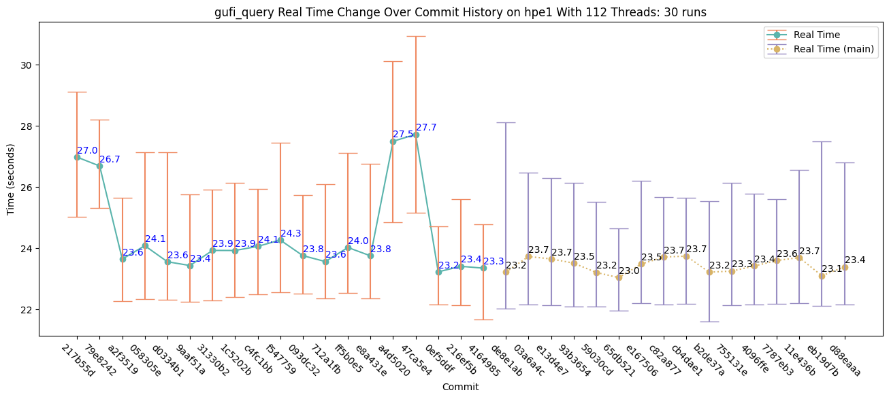

# Performance Tracking and Graphing

This directory contains scripts for collecting performance numbers from GUFI tools across commits and generating graphs using those numbers.

## Prerequisites
* `git 1.8.5+`
* `Python 2.7+`
* GUFI must be configured with **Debug** mode enabled and one of the debug prints supported by extract.py (currently only `PRINT_CUMULATIVE_TIMES`).
* (Optional) Graph generation requires **Matplotlib** version 2.2.5 or better for user's Python version. The non-graphing scripts will be placed into the build directory even if Matplotlib is not found.

## Notes
* Unless explicitly specified, the executables run in the examples below are located in the performance directory of the build directory (e.g. `GUFI/build/contrib/performance`).
* Running through the workflow below will not yield the same exact output. This workflow is meant to be a generic example.
* Not every flag for each executable is listed below. Use `--help` or `-h` to print help menus.

## Setup:
1. Setup Python Environment:

    ```bash
    export GUFI_BUILD="GUFI/build"
    export PYTHONPATH="${GUFI_BUILD}/contrib:${PYTHONPATH}"
    export PYTHONPATH="${GUFI_BUILD}/contrib/performance:${PYTHONPATH}"
    export PYTHONPATH="${GUFI_BUILD}/scripts:${PYTHONPATH}"
    ```
2. Use **setup_hashdb.py** to initialize a database to store unique identifiers and the data that was used to generate them.
    * This database contains the tables:
        * **machine_config** - contains information about the machine where GUFI is being benchmarked
        * **gufi_command** - contains the command used to generate the performance numbers being collected
        * **raw_data** - maps the `machine_config` and `gufi_command` unique identifiers to a single unique identifier

    * **Syntax**: `setup_hashdb.py <database>`

    * **Example**:

    ```bash
    $ setup_hashdb.py hashes.db
    ```

    The **hashes.db** file will be created with no output. This file should be used for all `--database` and `<database>` arguments passed into the following scripts.

3. Use **machine_hash.py** to create a unique identifier for the machine that GUFI will be benchmarked on.
    * **Syntax**: `machine_hash.py [optional arguments that describe the machine]`
        * Use `--database` to store the unique identifier in the **machine_config** table of the hash database.
        * This will run with **no arguments**.

    * **Example**:

    ```bash
    $ machine_hash.py --cores 8 --ram 8GB --database hashes.db
    d15e2506a6c1664f7e931b55f39d06fd
    ```

4. Use **gufi_hash.py** to create a unique identifier for the GUFI command that will be benchmarked.
    * **Syntax**: `gufi_hash.py <gufi_command> <debug_name> <tree> [gufi command flags]`
        * Use `--database` to store the unique identifier in the **gufi_command** table of the hash database.
        *  `<debug_name>` can be one of the following:
            * For `gufi_query`
                * **cumulative_times**
                * **cumulative_times_terse**
                    * **cumulative_times** data printed in a different format; data is placed into the **cumulative_times** table
                    * Pass `-j` to `gufi_query` and `gufi_hash.py`
            * For `gufi_trace2index`
                * **cumulative_times**

    * **Example**:

    ```bash
    $ gufi_hash.py gufi_query cumulative_times /path/to/tree -n 16 -S "SELECT uid FROM summary;" --database hashes.db
    0b5c2dbf57a397906f1d4bf7cf4fae4c
    ````

5. Use **raw_data_hash.py** to create a unique identifer that combines the **machine_hash** and **gufi_hash**.
    * **Syntax**: `raw_data_hash.py <machine_hash> <gufi_hash>`
        * Use `--database` to store the unique identifier in the **raw_data** table of the hash database

    * **Example**:

    ```bash
    $ raw_data_hash.py d15e2506a6c1664f7e931b55f39d06fd 0b5c2dbf57a397906f1d4bf7cf4fae4c --database hashes.db
    825577c396836cdaa6491b7bfb6901c9
    ```

6. Use **setup_raw_data_db.py** to initialize a database that will contain raw numbers extracted from runs of a GUFI tool.
    * The database will contain only one of the following tables:
        * **cumulative_times** (for `gufi_query`)
        * **cumulative_times** (for `gufi_trace2index`)

    * **Syntax**: `setup_raw_data_db.py <database> <raw_data_hash> <raw_data_db>`

    * **Example**:

    ```bash
    $ setup_raw_data_db.py hashes.db 825577c396836cdaa6491b7bfb6901c9 raw_numbers.db
    825577c396836cdaa6491b7bfb6901c9 was run with gufi_query, debug name cumulative_times
    ```

    **raw_numbers.db** will be created with (in this case) the **cumulative_times** table for `gufi_query`.

## Collecting One Set of Performance Numbers
Use **extraction.py** to extract a single set of performance numbers and store them in the database generated by **setup_raw_data_db.py**.

* **Syntax**: `<gufi_cmd> 2>&1 >/dev/null | extract.py <database> <raw_data_hash> [raw_data_db]`
    * `raw_data_db` is optional to allow for `stdin` to only be processed, not stored. This can be useful for figuring out whether or not a set of debug output can be parsed.

* **Example**:

```bash
$ ${GUFI_BUILD}/src/gufi_query -n 16 -S "SELECT uid FROM summary;" /path/to/tree 2>&1 >/dev/null | extract.py hashes.db 825577c396836cdaa6491b7bfb6901c9 raw_numbers.db
825577c396836cdaa6491b7bfb6901c9 was run with gufi_query, debug name cumulative_times
```

The benchmark numbers from `gufi_query` will be stored in the **cumulative_times** table of **raw_numbers.db**.

## Collecting Multiple Sets of Performance Numbers Across Commits
A user may want to automatically collect data for multiple runs, possibly across multiple commits. `collect_performance.sh` was written to simplify this task.

An additional copy of the GUFI repository (`GUFI_variable`) will also be required when running `collect_performance.sh`. `GUFI_variable` will be moved across commits so that the scripts doing the collection are not modified while collecting data. Generally, `GUFI_variable` should be configured before running `collect_performance.sh`. If the source for `GUFI_variable` is not found, the GUFI source will be cloned into the parent directory of `GUFI_variable` and be automatically configured with the minimum `CMake` options required.

* **Syntax**: `collect_performance.sh <gufi_variable_build> <database> <raw_data_hash> <raw_data_db> [identifier]... [--runs <count>] [--sudo]`
    * `[identifier]...` is a list of any [commit-ish or tree-ish identifiers](https://stackoverflow.com/a/23303550) that `git` can convert into commit hashes:
        * **A single identifier**: `commit1`
        * **A range**: `commit2..commit4`
            * Will collect numbers from `commit4` and `commit3`, but not `commit2`
            * Suffix a range with the `%` character followed by an integer to denote distance between commits
                * `commit5..commit67%8` will collect numbers from `commit67`, `commit59`, `commit51`, ... up to but not including `commit5`
    * `--runs`: How many times to run the GUFI command on a single commit
    * `--sudo`: Run the GUFI command with sudo (in case the tree has permissions set)
    * Before each run of the GUFI command, this script drops caches, which requires root access.
        * The `--dont-drop-caches` flag can be used to skip dropping caches, but the numbers collected will contain cache performance rather than storage device performance. **Use of this flag is highly discouraged.**

* **Example**:

```bash
$ collect_performance.sh GUFI_variable/build/ hashes.db 825577c396836cdaa6491b7bfb6901c9 raw_numbers.db HEAD~300..HEAD%15 --runs 2 --sudo
HEAD is now at c8cdd6e Collect performance will fail if build fails or extraction fails
825577c396836cdaa6491b7bfb6901c9 was run with gufi_query, debug name cumulative_times
825577c396836cdaa6491b7bfb6901c9 was run with gufi_query, debug name cumulative_times
...
Previous HEAD position was 03e525e test server/client rpms
HEAD is now at 5e928ac cleanup
825577c396836cdaa6491b7bfb6901c9 was run with gufi_query, debug name cumulative_times
825577c396836cdaa6491b7bfb6901c9 was run with gufi_query, debug name cumulative_times
```

## Graphing
Use **graph_performance.py** to compute basic statistics on the data stored in the raw data database and plot them on a graph.

* **Syntax**: `graph_performance.py <database> <raw_data_hash> <raw_data_db> <config_file>`
    * Override flags of the form `--{section}_{key} {value}` can be provided to override configuration file values from the command line. The override value should be a string in the same format as the value passed into the configuration file.

* **Example**:

```bash
$ graph_performance.py hashes.db 825577c396836cdaa6491b7bfb6901c9 raw_numbers.db configs/db_query.ini
```

The script does not print anything to stdout, but does create an image file as specified by the configuration.


